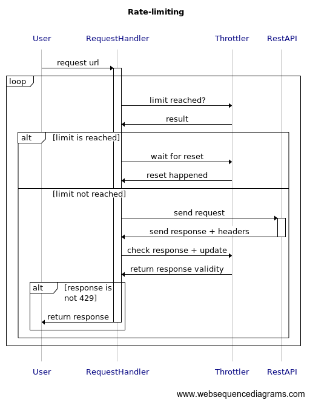

### Applies to [All languages]

# Backend
The backend of every wrapper **must** include the following features:
- Request-efficient data loading
- Fully asynchronous design
- Automatic rate-limiting
- Easy to maintain between different languages
- Username/UUID equivalence

Request-efficient data loading
--
All data structures in the wrapper should implement lazy loading of data.
This means that only when actual API data needs to be returned, an actual request should be made.
For example:
- when requesting a `HypixelPlayer` data structure from `HypixelAPI`, no request should be made since this is not exclusive data from the API.
- when requesting the different friends of a player, a request should be made since this is exclusive data from the API
- when requesting the specific amount of wins for a certain minigae, a request should be made since this is exclusive data from the API.
- when requesting a `HypixelGuild` data structure from `HypixelAPI`, no request should be made since this is not exclusive data from the API.

All requests should be routed through `HypixelAPI` or a data structure stored internally in `HypixelAPI`.
This data structure is then responsible for updating and checking the cache.
It should only send http requests to the `Hypixel API` for data that isn't in the cache or cached data that is expired.

Fully asynchronous design
--
All methods that can result in a http request being executed **must** be asynchronous, a single method in the wrapper **must** never block the thread.
The specific design choices of dealing with asynchronous requests is up to each language.

Automatic rate-limiting
--
To efficiently maximize the ease of use for the end user while also avoid getting rate-limited by `Hypixel API`,
all wrappers should implement the following rate-limiting scheme.

 

`HypixelAPI` has only 1 `RequestHandler` and 1 `Throttler`. The interactions between `RequestHandler` and `Throttler` **must** be threadsafe.
The response to a error `429: too many requests` (this is rare) should be to reschedule the request as denoted in the diagram by the loop.

The implementation of this scheme for every language should be made as performant and idiomatic as possible.
It is not to be taken as literal pseudocode but a conceptual description of what interactions happen what order.

Username/UUID equivalence
--
`Hypixel API` encourages to only use `UUID`s for players instead of their usernames. For this reason, the wrappers should also provide a cache and request system explicitly to convert usernames into `UUID`s (and vice versa).

This should be done by first consulting `Mojang API` and as a backup `playerdb.co`.

### Need help?
If you have any suggestions, or are unsure of any information, please join our Discord server and ask: [Invite Link](https://discord.com/invite/NkRQHemWtJ) 
Thanks so much for contributing to this project ❤️
